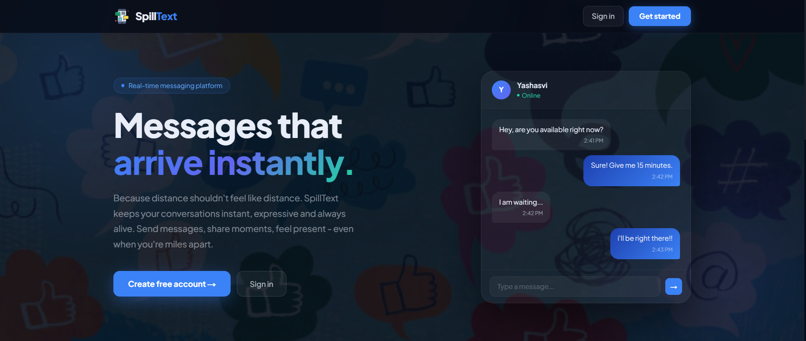
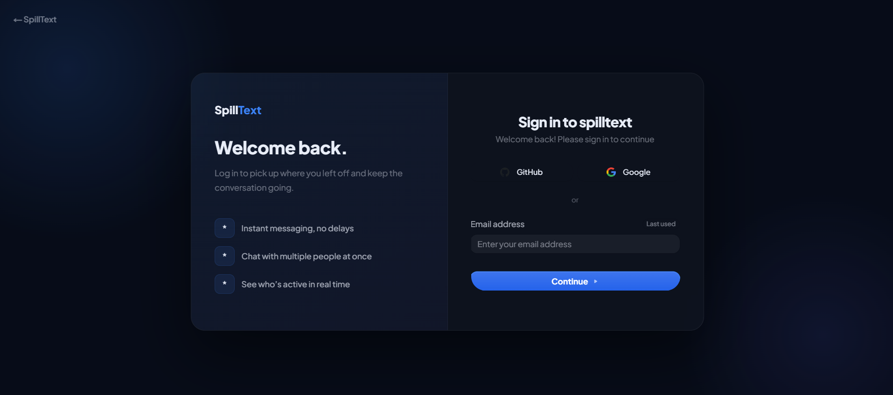
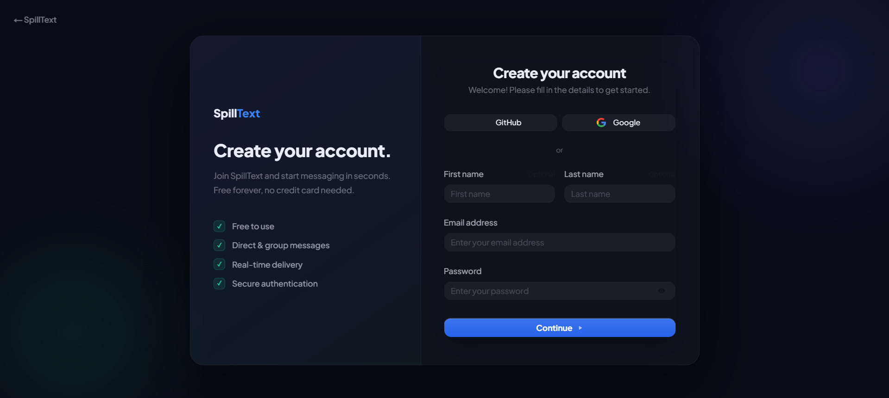
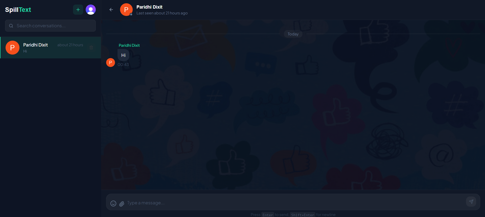
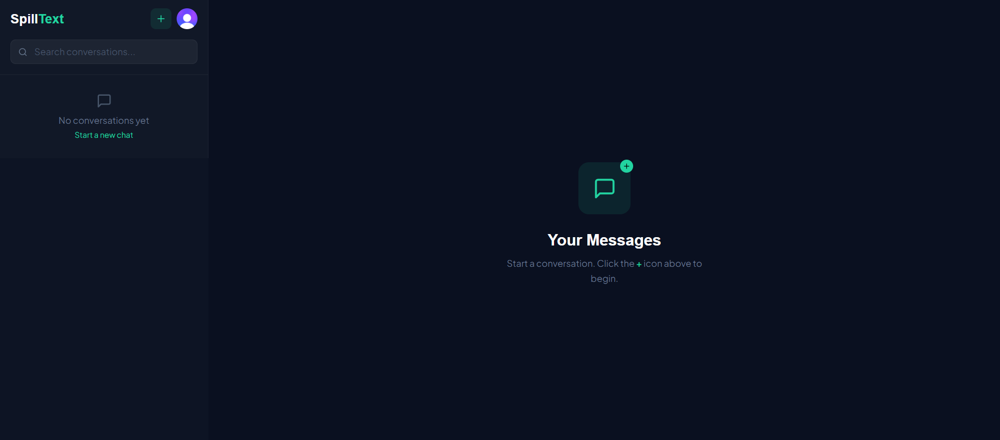
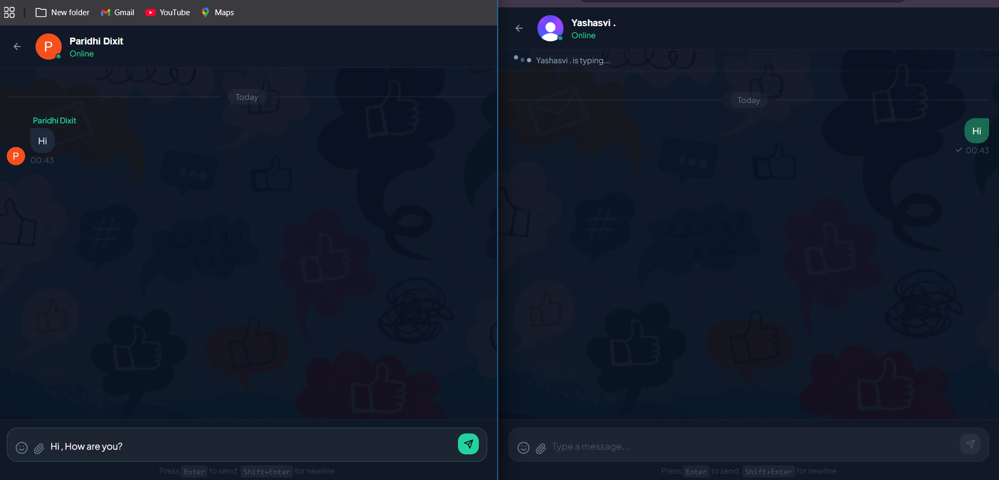
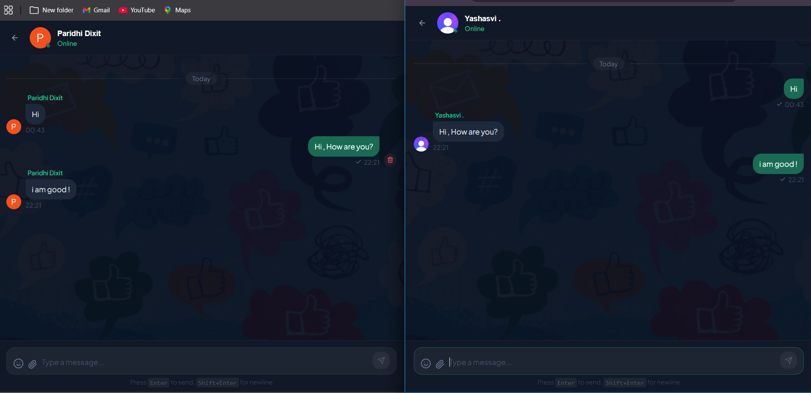
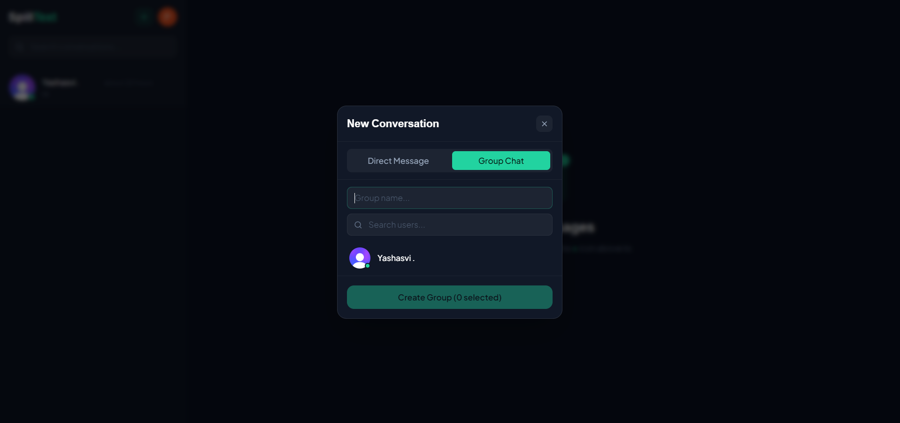
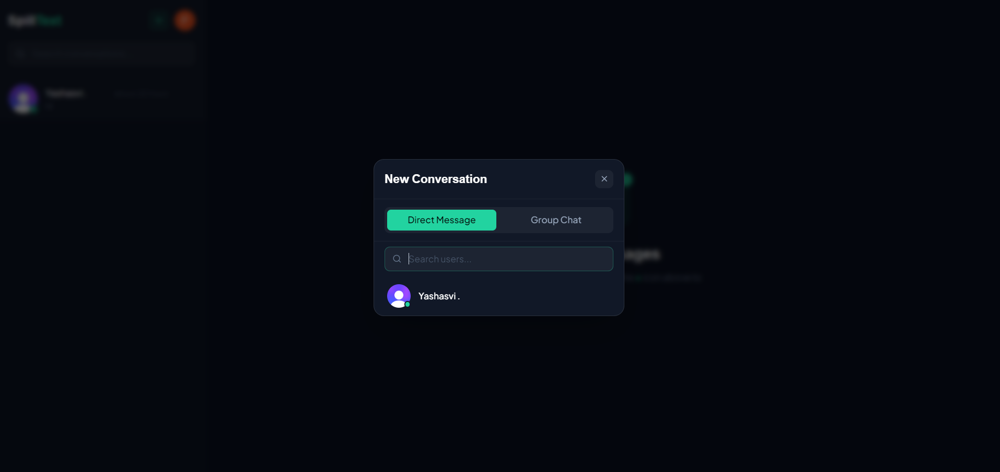
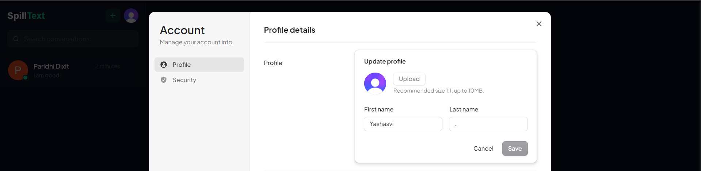

# SpillText : Real-Time Messaging App

Where Conversation flows , SpillText is a live chat web-application built with **Next.js**, **TypeScript**, **Clerk**, and **Convex**.

**Live Demo:** https://spill-text-real-time-chat-app.vercel.app/

---

## Screenshots

**Home**



**Sign In / Sign Up**




**Chat Interface**




**Live Messaging & Delete**




**Group Chat**



**Search Users**



**Update Profile**



---

## Features

- Sign in with Email, Google, or GitHub (via Clerk)
- Direct messaging = real-time, one-on-one
- Group chats with multiple members
- Online presence indicators
- Read receipts
- Delete your own messages
- Update your profile with an image
- All updates are instant — no refresh needed

---

## Tech Stack

| Technology | Purpose |
|---|---|
| Next.js 14 | React framework with App Router |
| TypeScript | Type safety |
| Clerk | Authentication & user management |
| Convex | Real-time backend + database |
| Tailwind CSS | Styling |


## Getting Started

### Prerequisites

- Node.js 18+
- A [Clerk](https://clerk.com) account
- A [Convex](https://convex.dev) account

### Installation

```bash
git clone <your-repo>
cd SpillText
npm install
```

### Set Up Convex

```bash
npx convex dev
```

This connects your backend and gives you a `NEXT_PUBLIC_CONVEX_URL`.

### Set Up Clerk

1. Create an app at [clerk.com](https://clerk.com)
2. Copy your Publishable Key and Secret Key
3. Add a webhook endpoint in the Clerk dashboard:
   - URL: `https://YOUR_CONVEX_URL/clerk-webhook`
   - Events: `user.created`, `user.updated`
4. Copy the Signing Secret — you'll need it below

### Environment Variables

Create a `.env.local` file and fill in:

```env
NEXT_PUBLIC_CLERK_PUBLISHABLE_KEY=pk_test_...
CLERK_SECRET_KEY=sk_test_...
NEXT_PUBLIC_CLERK_SIGN_IN_URL=/sign-in
NEXT_PUBLIC_CLERK_SIGN_UP_URL=/sign-up
NEXT_PUBLIC_CLERK_AFTER_SIGN_IN_URL=/
NEXT_PUBLIC_CLERK_AFTER_SIGN_UP_URL=/

NEXT_PUBLIC_CONVEX_URL=https://your-deployment.convex.cloud
```

Set the webhook secret in Convex:

```bash
npx convex env set CLERK_WEBHOOK_SECRET whsec_YOUR_SECRET
```

### Run the App

Open two terminals:

```bash
# Terminal 1
npx convex dev

# Terminal 2
npm run dev
```

Visit [http://localhost:3000](http://localhost:3000)

---

## Project Structure

```
SpillText/
├── app/
│   ├── layout.tsx
│   ├── page.tsx
│   ├── globals.css
│   ├── sign-in/page.tsx
│   ├── sign-up/page.tsx
│   └── chat/
│       ├── page.tsx
│       └── [conversationId]/page.tsx
├── components/
│   ├── ConvexClientProvider.tsx
│   └── chat/
│       ├── Sidebar.tsx
│       ├── ChatWindow.tsx
│       ├── ChatHeader.tsx
│       ├── MessageBubble.tsx
│       ├── ChatInput.tsx
│       └── EmptyChat.tsx
├── convex/
│   ├── schema.ts
│   ├── users.ts
│   ├── conversations.ts
│   ├── messages.ts
│   └── http.ts
└── middleware.ts
```

---

## Architecture

```
User → Clerk Auth → Next.js App
                         ↓
                   Convex Backend
                    ┌──────────┐
                    │ users    │  ← synced via Clerk webhooks
                    │ convos   │  ← real-time subscriptions
                    │ messages │  ← instant delivery
                    └──────────┘
```

Authentication is handled by Clerk. User data syncs to Convex through webhooks, and all queries use Convex's live subscriptions so the UI updates automatically. Mutations verify the user's `clerkId` before touching any data.

---

## Deployment

```bash
# Frontend
vercel deploy

# Backend
npx convex deploy
```

Add all environment variables in your Vercel dashboard.

---
